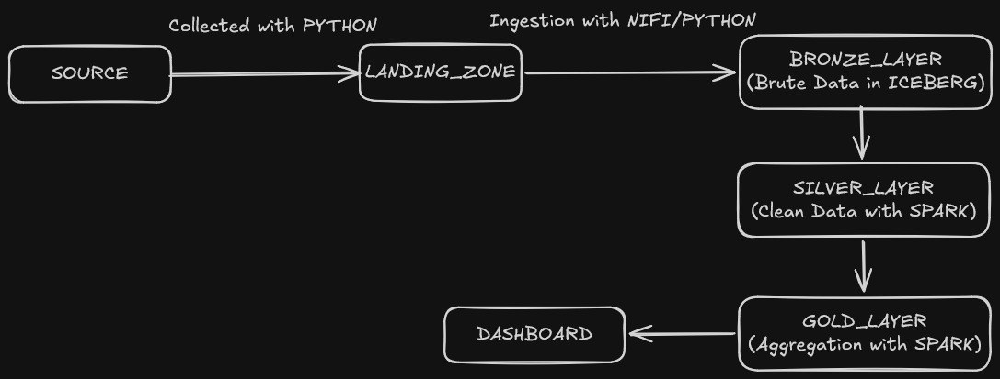

#  Data Pipeline para Monitoramento de Incidentes de TI

Pipeline de dados end-to-end em arquitetura Medallion para ingestão, processamento e visualização de incidentes de tecnologia em tempo quase-real. O sistema transforma dados brutos de chamados/eventos de infraestrutura em métricas executivas como **MTTR** (Mean Time to Repair), **MTTD** (Mean Time to Detect) e taxa de conformidade de **SLA**.

---

##  Tecnologias e Ferramentas

| Categoria | Tecnologia | Função no Projeto |
| :--- | :--- | :--- |
| **Fonte / Ingestão** | Python / Apache NiFi | Coleta e simulação de eventos de incidentes em formato JSON. |
| **Data Lake Storage** | Apache Iceberg + MinIO (S3) | Armazenamento de alta performance em formato de tabela aberta (ACID, Time Travel, Schema Evolution). |
| **Processamento** | Apache Spark | Limpeza, desduplicação, padronização de schemas e agregações em lote/micro-batch. |
| **Orquestração** | Apache Airflow | Agendamento, monitoramento de dependências e execução contínua das DAGs. |
| **Visualização** | Streamlit | Dashboard interativo para equipes de SRE, NOC e liderança de TI. |
| **Infraestrutura** | Docker & Kubernetes | Containerização de toda a stack e orquestração de microsserviços/módulos para produção. |

---

##  Arquitetura do Pipeline



---

##  Estruturas de Pasta

```text
.
├── config/                         # Configurações globais, variáveis de ambiente e perfis do Spark
├── dags/                           # DAGs e operadores customizados do Apache Airflow
├── dashboard/                      # Interface e componentes da aplicação Streamlit
├── docker/                         # Dockerfiles por serviço
│   ├── airflow/
│   └── spark/
├── Imagens/
│   └── Architecture.excalidraw.png
├── k8s/                            # Manifestos do Kubernetes
│   ├── base/                       # Recursos base (Airflow, MinIO, Spark, Streamlit)
│   └── overlays/                   # Configurações específicas por ambiente
│       ├── dev/
│       └── prod/
├── src/                            # Código-fonte modularizado da pipeline
│   ├── ingestion/                  # Scripts de coleta via API ou NiFi
│   ├── spark/                      # Jobs PySpark organizados por camada
│   │   ├── bronze/                 # Carga dos dados brutos para tabelas Iceberg
│   │   ├── silver/                 # Limpeza, desduplicação e cálculo de SLA
│   │   └── gold/                   # Agregações de negócio (MTTR, MTTD, volume)
│   └── utils/                      # Módulos compartilhados
│       ├── s3_client/
│       ├── loggers/
│       └── iceberg_catalog/
├── tests/                          # Testes unitários e de integração
├── .gitignore
├── docker-compose.yml              # Orquestração local de toda a stack
├── LICENSE
├── README.md
└── requirements.txt                # Dependências globais de desenvolvimento Python
```

---
##  Camadas de Dados (Medallion Architecture)

1. **Landing Zone:** Ponto de entrada no MinIO/S3 para os arquivos JSON gerados via Python.
2. **Bronze Layer:** Ingestão dos dados brutos em formato Apache Iceberg sem tratamento (`Brute Data in ICEBERG`), preservando o histórico exato recebido.
3. **Silver Layer:** Processamento via Spark (`Clean Data with SPARK`) para limpeza, desduplicação, normalização e cálculo de SLA/downtime.
4. **Gold Layer:** Tabelas analíticas agregadas via Spark (`Aggregation with SPARK`) prontas para consumo de BI e métricas executivas.
5. **Dashboard:** Camada final de apresentação no Streamlit conectada aos dados agregados da camada Gold.

---

##  Valor Prático para o Negócio

Em ambientes corporativos, a indisponibilidade de sistemas gera custos imediatos e perda de reputação. Esta solução ajuda as empresas a:

* **Reduzir o MTTR (Tempo Médio de Reparo):** Identifica quais tipos de incidentes demoram mais para serem resolvidos e em quais equipes há gargalos.
* **Garantia de SLA:** Monitora em tempo real a porcentagem de chamados que ultrapassam o tempo limite contratado com o cliente ou áreas internas.
* **Análise de Causa Raiz:** Permite cruzar picos de incidentes com módulos específicos da aplicação (ex: Banco de Dados vs. Autenticação), direcionando investimento em refatoração técnica.